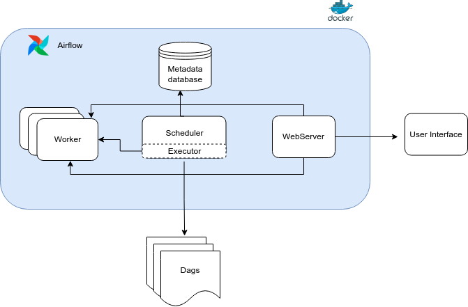
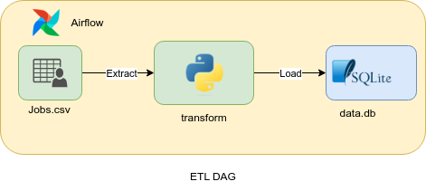

<div align="center">


<h3 align="center">DNA Engineering Data Assignment
</h3>

  <p align="center">
	The beauty of pipelines
    <br />
    <br />
	<a href="#linkdin">Linkdin</a>
    ·
    <a href="#contribute">Contact me</a>
    ·
    <a href="">Report Bug</a>
  </p>

 &emsp;
 &emsp;

</div>


## About The Project <!-- omit in toc -->


This project is a data engineering assignment for DNA Engineering. The project is a simple data pipeline that reads data from a csv file, transforms it and loads it into a sqlite database. The pipeline is built using Apache Airflow and Docker.

## Table of Contents <!-- omit in toc -->
- [Pre-requisites](#pre-requisites)
- [Installation](#installation)
    - [🚨 Before we begin](#-before-we-begin)
  - [Docker Setup](#docker-setup)
  - [Run Docker Compose](#run-docker-compose)
    - [Script Usage](#script-usage)
- [Setup SQLite Connection](#setup-sqlite-connection)
- [Project Structure](#project-structure)
  - [ETL Pipeline](#etl-pipeline)
- [Running the pipeline](#running-the-pipeline)
- [Contact](#contact)


## Pre-requisites

The project requires the following to be installed on your system:

* Docker
* Docker-compose (or using `docker compose`)
* Apache Airflow 2.8.0
* python 3.8 or higher

## Installation

#### 🚨 Before we begin

The following steps assumes that you have familiarity with Docker and Docker Compose. If you haven’t worked with these tools before, you should take a moment to run through the [Docker Get Started](https://docs.docker.com/get-started/) guide and the [Docker Compose Get Started](https://docs.docker.com/compose/gettingstarted/) guide.


Also by this time you should have setup your virtual environment and installed the required packages.


### Docker Setup

For the project setup we used docker and `docker-compose.yml`, to run airflow in a light weight container. which is the easiest way to get started with airflow.

A guide step by step guide to setup airflow using docker can be found [here](https://airflow.apache.org/docs/apache-airflow/stable/howto/docker-compose/index.html).


Some services were removed from the `docker-compose.yml` file, as they were not needed for the project. The services removed are:

* `flower`
* `redis`

### Run Docker Compose

A script file is provided with the project for easy command execution.

The `airflow` is used to manage an Apache Airflow environment using Docker. It includes functions to clean up the environment, initialize the database, and run Airflow, the airflow script uses the airflow-cli image to run the airflow commands.

#### Script Usage

- `runairflow`: This function starts up the Airflow services using Docker Compose. It's used to run Airflow in a Docker environment.
    ```shell
    ./airflow.sh runairflow
    ```
- `restart`: This function restarts all services. It first brings down all services using Docker Compose and then brings them back up.
    ```shell
    ./airflow.sh restart
    ```
- `rebuild`: This function rebuilds all services. It brings down all services, initializes the database, and then brings the services back up.
    ```shell
    ./airflow.sh rebuild
    ```
- `cleanup`: This function is not shown in the provided script excerpt, but based on its usage, it likely cleans up resources related to the Docker environment.
    ```shell
    ./airflow.sh cleanup
    ```
- `initdb`: This function is also not shown in the provided script excerpt, but based on its usage, it likely initializes the database for the Airflow services.
    ```shell
    ./airflow.sh initdb
    ```

The script also checks if the `docker-compose` command is available. If not, it uses `docker compose` instead.




## Setup SQLite Connection

The project uses a SQLite database to store the data. The database is created in the `load` folder. but first airflow needs to know our database which is easy to create either by using the airflow UI or by command.

```bash
./airflow.sh connections add 'sqlite_default' --conn-type 'sqlite' --conn-host 'load/data.db'
```

## Project Structure

```
├── airflow.sh
├── config
├── dags
├── doc
├── load
├── logs
├── README.md
├── source
├── staging
├── tests
├── requirements.txt
└──  docker-compose.yaml
```

- `airflow.sh`: A shell script for managing your Airflow services.

- `config`: A folder containing the configuration files for the Airflow services.

- `dags`: A folder containing the DAG files for the Airflow services.

- `doc`: A folder containing the documentation for the project.

- `load`: A folder containing the SQLite database.

- `logs`: A folder containing the logs for the Airflow services.

- `source`: A folder containing the source data for the project.

- `staging`: A folder containing the staging data for the project.

- `tests`: A folder containing the tests for the project.

- `requirements.txt`: A file containing the required packages for the project.

- `docker-compose.yaml`: A file containing the Docker Compose configuration for the Airflow services.


### ETL Pipeline

The ETL pipeline is implemented in the `dags/etl.py` file. The pipeline is implemented as a single DAG with three tasks:

1. **Extract**: The `extract_csv` function is responsible for the extraction process. It reads a CSV file from the provided path using pandas' `read_csv` function. It then iterates over each row of the DataFrame. If the "context" column of a row is not empty, it writes the context to a new text file in the `STAGING_EXTRACTED` directory. Each text file is named with the row index.

2. **Transform**: The transformation process is handled by the `transform` function. It reads the text files from the `STAGING_EXTRACTED` directory and iterates over each file. For each file, it reads the contents of the file and transform it into a JSON format ready to be loaded into the database.

3. **Load**: The `load_to_db` function is responsible for loading the data into the database. It reads the JSON files from the `STAGING_TRANSFORMED` directory and iterates over each file. For each file, it reads the contents of the file and loads it into the database using the `sqlite` hook.




## Running the pipeline

The following gif shows the pipeline running in the airflow UI.


## Contact

For any questions or suggestions, feel free to contact me.

- [Linkdin](https://www.linkedin.com/in/nabouzi-yasser/).